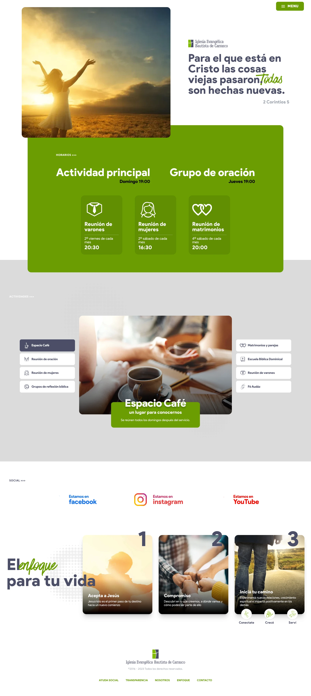

# Iglesia de Carrasco

Website created using Nuxt.js, TailwindCSS, and the WordPress REST API in November 2022.

I have designed and programmed the entire website, consuming the WordPress REST API in a single backend call. The data is stored in a Pinia store and is then used to display the corresponding information on each page.